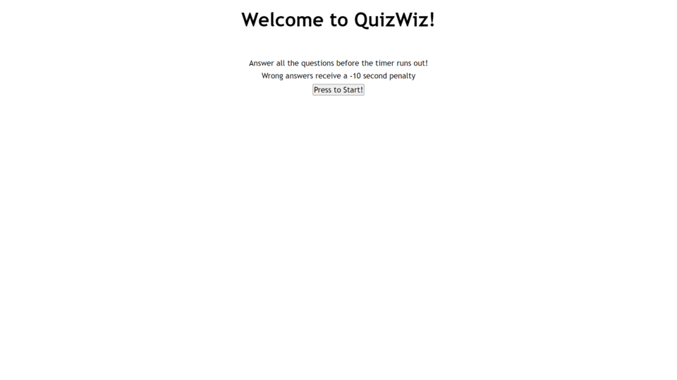

# QuizWiz

[Link](https://kashane1.github.io/quiz-wiz/)
-----------
Following the link above will bring you to the QuizWiz!

-----------
Requirements:
-----------

1. The user is presented with a quiz upon clicking the start button.
2. The timer starts and is shown for the duration of the quiz.
3. Answering any question will bring you to the next question.
4. If a question is answered wrong, the timer is reduced by 10 seconds.
5. After all questions are answered, or the timer reaches 0, the user is prompted to enter their initials and their score is visible.

-----------
Process:
-----------
This was definitely a very challanging assignment. I struggled for hours trying to get the buttons to work properly. I reach a solution that I'm very satisfied with even though I'm aware there is must be better solutions out there. 

I started with pseudo code and got a lot of good ideas going. Worked out the larger layout of the script and then worked on each section of the script. This way help me organize my thoughts. I had a few routes that I felt comfortable taking and I took them all. This is my final product and I'm satisfied with it. I'm also happy to make changes based on my code review because I know it's exactly perfect.

-----------
```
preview of QuizWiz:
```


-----------
Cited:
-----------
https://www.w3schools.com/ - for javascript references

https://developer.mozilla.org/en-US/ - for javascript references

https://www.freecodecamp.org/news/how-to-center-anything-with-css-align-a-div-text-and-more/ - I love freecodecamp, they've helped me learn so much in the past and still do. And for some reason I still struggle slightly with aligning things on my page

https://gifmaker.me/ - for the screengrab of QuizWiz to place in the readme

-----------